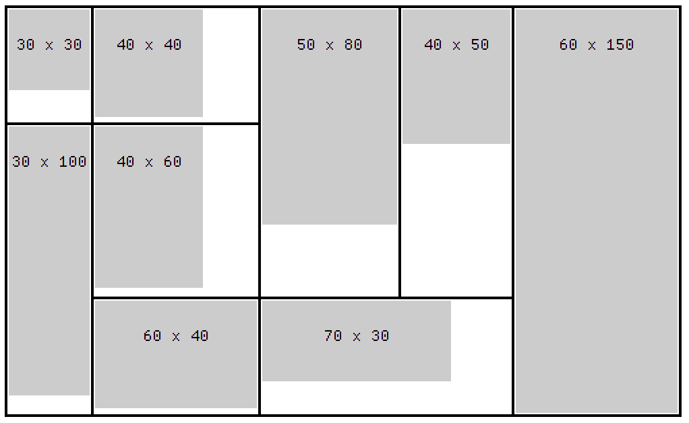

# Tables for Layout FTW

## Summary

You are given an `W`x`H` grid filled with various sized rectangles. 
The width of each column and each row is the smallest size possible such that it can hold all the rectangles without overlapping.

However some rectangles can span multiple columns and multiple rows.

Given a list of `N` rectangles and their row and column spans, how big is the table?



This table is 240 x 150.

## Input

A list of N rectangles and a table to 

A 2-D matrix of `N`x`N` with robots represented by 2 and walls represented by 1. Empty spaces are marked as 0.

## Output

A simple tuple of the row index and column index where the bomb kills the most robots.

If there are multiple possibilities that kill the same number of robots, return the appropriate coordinates in a list.

## Example

Input: 

```
{
  "columns": 5,
  "rows": 3,
  "rectangles": [
	{ "size": [30, 30], "col": 0, "row": 0, "colspan": 1, "rowspan": 1 },
	{ "size": [40, 40], "col": 1, "row": 0, "colspan": 1, "rowspan": 1 },
	{ "size": [50, 80], "col": 2, "row": 0, "colspan": 1, "rowspan": 2 },
	{ "size": [40, 50], "col": 3, "row": 0, "colspan": 1, "rowspan": 2 },
	{ "size": [60, 150], "col": 4, "row": 0, "colspan": 1, "rowspan": 3 },
	{ "size": [30, 100], "col": 0, "row": 1, "colspan": 1, "rowspan": 2 },
	{ "size": [40, 60], "col": 1, "row": 1, "colspan": 1, "rowspan": 1 },
	{ "size": [60, 40], "col": 1, "row": 2, "colspan": 1, "rowspan": 1 },
	{ "size": [70, 30], "col": 2, "row": 2, "colspan": 2, "rowspan": 1 },
  ]
}
```

Output: `[240, 150]`

## Constraints 

1 < `W` < 100

1 < `H` < 100 

1 < `N` < 10^4
